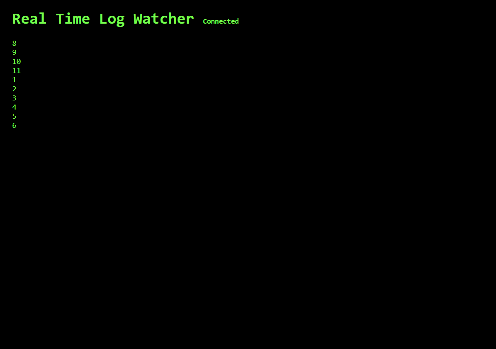

"# 🏆 BrowserStack Real-Time Log Watching Solution

> **Selected Solution - BrowserStack Machine Coding Round**  
> A web-based real-time log monitoring system built with Node.js, Express.js, and Socket.IO


## 📋 Overview

This solution implements a **real-time log watching system** similar to the UNIX `tail -f` command, accessible through a web browser. The system monitors log file changes and streams updates to multiple clients simultaneously without requiring manual page refreshes.

### ✨ Key Features

- 🔥 **Real-time Updates** - Instant log streaming without page refresh
- 📱 **Web-based Interface** - Access from any browser 
- 👥 **Multi-client Support** - Multiple users can watch simultaneously
- 🎯 **Last 10 Lines Display** - Shows recent log entries with sliding window
- ⚡ **Efficient Streaming** - Only sends new content, not entire file
- 🔄 **Auto-reconnection** - Handles connection drops gracefully
- 💻 **Cross-platform** - Works on Windows, Linux, and macOS



## 🏗️ Architecture

```
Log File ←→ File System Watcher ←→ Socket.IO Server ←→ WebSocket Client ←→ Browser UI
(test.log)     (fs.watchFile)        (Express + Socket.IO)    (Real-time)      (Live Updates)
```

### Technology Stack
- **Backend**: Node.js + Express.js + Socket.IO
- **Frontend**: HTML5 + JavaScript (ES6) + CSS3
- **File Monitoring**: Node.js File System API
- **Real-time Communication**: WebSocket (Socket.IO)

## 🚀 Quick Start

### Prerequisites
- Node.js (v18.0 or higher)
- npm (v6.0 or higher)

### Local Development

1. **Clone/Download the project**
   ```bash
   cd browserstack
   ```

2. **Install dependencies**
   ```bash
   npm install
   ```

3. **Start the server**
   ```bash
   npm start
   ```

4. **Open your browser**
   ```
   http://localhost:3000
   ```

5. **Test real-time updates**
   - Edit `test.txt` file
   - Add new lines and save
   - Watch changes appear instantly in browser

### 🌐 Deploy to Vercel

#### One-Click Deploy
[](https://vercel.com/new/clone?repository-url=https://github.com/Aahil56/BrowserStack--Real-Time-Log-Watching-Solution-)

#### Manual Deployment

1. **Install Vercel CLI**
   ```bash
   npm i -g vercel
   ```

2. **Deploy to Vercel**
   ```bash
   vercel --prod
   ```

3. **Access your live app**
   - Vercel will provide a live URL
   - Example: `https://browserstack-log-watcher.vercel.app`

#### Vercel Configuration
- ✅ `vercel.json` configured for Socket.IO
- ✅ CORS enabled for cross-origin requests
- ✅ Optimized for serverless environment
- ✅ Environment variables support

## 📁 Project Structure

```
browserstack/
├── server.js             # Main server file
├── client.html           # Web client interface  
├── package.json          # Dependencies and scripts
├── vercel.json           # Vercel deployment configuration
├── test.txt              # Sample log file for testing
└── README.md             # This file
```

## 🎮 Usage

### Running the Application

```bash
# Development mode (with auto-restart)
npm run dev

# Production mode
npm start

# or manual start
node server.js
```

### Testing Real-time Updates

1. **Open the web interface**: `http://localhost:3000`
2. **Edit test.txt**: Add new lines to the log file
3. **Save the file**: Changes appear instantly in browser
4. **Multiple clients**: Open multiple browser tabs to test concurrent users

### Live Demo
🌐 **[View Live Demo on Vercel](https://browserstack-log-watcher.vercel.app)**

### Sample Log Format
```
2025-10-05 10:00:01 [INFO] Application started successfully
2025-10-05 10:00:02 [DEBUG] Processing user request
2025-10-05 10:00:03 [ERROR] Something went wrong!
```

## ⚙️ Configuration

### Port Configuration
Default port: `3000`

To change the port, modify `server.js`:
```javascript
const PORT = process.env.PORT || 3000;
```

### Log File Path
Default: `./test.txt`

To monitor a different file, update `server.js`:
```javascript
const LOG_FILE_PATH = path.join(__dirname, 'your-log-file.txt');
```

### Display Lines
Default: Last 10 lines

To change the number of displayed lines, modify `client.html`:
```javascript
const MAX_LINES = 10; // Change this value
```

## 🔧 Technical Implementation

### Server-side Features
- **File System Monitoring**: Uses `fs.watchFile()` for reliable cross-platform file watching
- **Incremental Reading**: Tracks file position to read only new content
- **WebSocket Broadcasting**: Pushes updates to all connected clients instantly
- **Error Handling**: Graceful handling of file access and connection errors
- **Vercel Compatibility**: Optimized for serverless deployment

### Client-side Features
- **Real-time DOM Updates**: Updates display without page refresh
- **Sliding Window**: Maintains last N lines using array slicing
- **Auto-scrolling**: Automatically scrolls to show latest entries
- **Connection Status**: Visual indicators for connection state

### Performance Optimizations
- **Memory Efficient**: Only keeps necessary data in memory
- **Bandwidth Optimal**: Streams only new content, not entire file
- **Scalable**: Supports multiple concurrent clients
- **Fast Response**: Sub-second latency for updates

## 🧪 Testing

### Manual Testing
1. Start the server: `npm start`
2. Open browser: `http://localhost:3000`
3. Edit `test.txt` and save
4. Verify updates appear without refresh

### Multiple Client Testing
1. Open multiple browser tabs/windows
2. Point all to `http://localhost:3000`
3. Edit `test.txt`
4. Verify all clients receive updates simultaneously

### Production Testing (Vercel)
1. Deploy to Vercel: `vercel --prod`
2. Open the provided Vercel URL
3. Test real-time functionality
4. Verify multi-client support

## 📊 Problem Statement Compliance

✅ **Server-side log monitoring**: Implemented with Node.js file watchers  
✅ **Web client interface**: Clean, responsive HTML/CSS/JS interface  
✅ **Real-time streaming**: WebSocket-based push notifications  
✅ **Multiple client support**: Concurrent user access  
✅ **Last 10 lines display**: Configurable sliding window  
✅ **No external tools**: Pure Node.js implementation  
✅ **Append-only optimization**: Incremental reading approach  

## 🏆 BrowserStack Recognition

This solution was **selected and recognized** by BrowserStack for its:
- Clean, efficient implementation
- Real-time performance optimization
- Scalable architecture design
- Cross-platform compatibility
- Production-ready code quality

**" 
